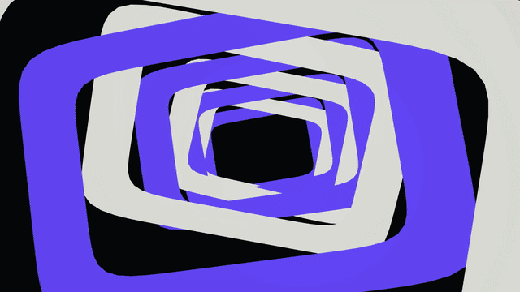

<p align="center">
  <video src="docs/music-studio-preview.mp4" autoplay loop muted playsinline controls width="960">
    
  </video>
</p>

# Droffel Music Studio

**A procedural music visualizer driven by a fixed fly-brain simulation.** Choose a track, let the six audio roles stimulate a 165,122-state neural model, and export a developing 2D/3D motion-design scene as an MP4.

Droffel Music Studio is a local, file-based tool for turning music into visual phrases. The composition develops inside a phrase: attacks prepare camera changes, bass bends mass, percussion cuts and opens surfaces, melodies reshape contours, and sustained sound holds the scene together. It is designed for authored-looking motion rather than a repeating spectrum effect.

## Features

- Audio-driven procedural scenes with phrase-level development and section changes.
- Fixed neural simulation with deterministic recordings and reproducible projects.
- Mixed 2D/3D forms: folded panels, rounded solids, rings, tunnels, printed surfaces and graphic masks.
- Clean export without editor controls or incidental text overlays.
- 4K UHD and 60 FPS MP4 export with constant frame timing; optional compact brain overlay.
- Cached projects that can be reopened without reprocessing the source track.
- All processing stays local. The selected audio, stems, recordings and model data are not uploaded.

## Start on Windows

Requirements: Python 3.11+, FFmpeg on `PATH`, and the Godot runtime downloaded by the project tools.

```powershell
py -3.11 -m venv .venv
.venv\Scripts\python.exe -m pip install -r requirements.txt
.venv\Scripts\python.exe -m pip install -r requirements-gpu.txt
.venv\Scripts\python.exe music_brain\launch.py
```

Or double-click [`music_brain/START_MUSIC_BRAIN.cmd`](music_brain/START_MUSIC_BRAIN.cmd). Choose an audio file, click **Process music**, then export the finished project as an MP4. The interface always uses the detailed separated-instrument analysis and keeps timing controls in the same view.

For a quick command-line export:

```powershell
.venv\Scripts\python.exe music_brain\prepare.py track.flac --start 30 --duration 20
.venv\Scripts\python.exe music_brain\export_video.py path\to\project.json output.mp4 --fps 60 --width 3840 --height 2160 --brain
```

## Design notes

The renderer combines opaque print design, closed panel geometry, controlled deformation and depth-aware 3D materials. Neural activity is used as a musical control signal; it is not a measurement from a living animal and the project does not claim biological hearing or biological understanding of music.

The repository contains source code, tests and documentation. Generated recordings, local paths, audio files, neural binaries, Godot caches and rendered videos are intentionally excluded. The animated preview above is a lightweight excerpt made from the renderer output.

## Development

```powershell
.venv\Scripts\python.exe -m pytest music_brain/tests -q
.tools\godot\Godot_v4.7.2-stable_win64_console.exe --headless --path music_brain/app --script res://scripts/test_scene_geometry.gd --quit-after 10
.venv\Scripts\python.exe music_brain\tools\review_video.py output.mp4 runtime\review --start 6 --duration 10 --fps 10
```

See [Music Studio architecture](music_brain/ARCHITECTURE.md), [Music Studio documentation](music_brain/README.md), and [third-party sources](THIRD_PARTY.md).

## License and attribution

See [THIRD_PARTY.md](THIRD_PARTY.md) for dependencies and attribution. Generated assets and user-selected audio remain local to the machine running the tool.
